# HOMEWORK WEEK 1
##### (handout for students)
## TASK 1 - Use Parts DB to write teh following queries:
#### 1. Find the name of each part where the weight is more than 14.
Answer:
- I check all parts to see what weight each has:

    USE parts;
    SELECT * FROM part;
    
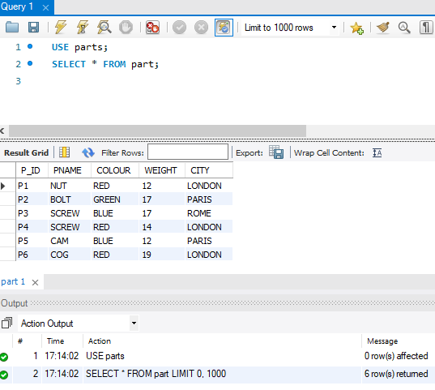
    
- Only 2 results have their weight below 14 and 1 is equal to 14, so 3 results should be excluded out of 6 parts total available in the part table – I run query to only show parts with weight above 14:

    USE parts;
    SELECT * FROM part WHERE weight > 14;
    
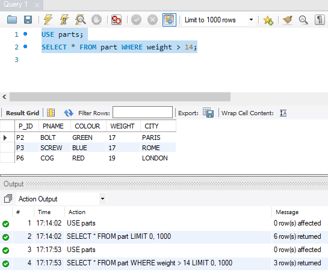
    
- The result is as expected and looks correct, 3 results have weight over 14.

#### 2. Find all unique supplier(s) where their status is equal to 20.
Answer:
- first I check all suppliers, to see where is the data of all suppliers in parts DB and how it looks like:

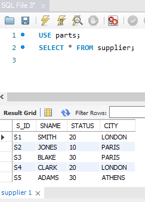

- data has both the required information (supplier name and status), so I go on to performing requested query: select those with status being equal to 20:

    USE parts;
    SELECT DISTINCT s.s_ID, s.sname, s.status FROM supplier AS s WHERE s.status = 20;

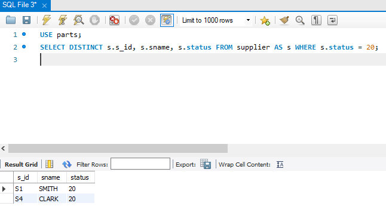

- result shows both unique suppliers with status = 20. 

NOTE 1 : While in this particular case using the keyword “DISTINCT” or not using it makes no difference, it is a good practice and makes a clean, understandable code to include it.

NOTE 2 : I also used the “supplier AS s” here in hopes it will turn off the blue colour from “status” if it’s written as “s.status” but it’s still blue, as if it were a keyword instead of a column name. I’ve highlighted that this is a table’s column, not a keyword by adding the table’s name to this column’s name.

## TASK 2 - Use Shop Sales DB to write the following queries:

#### 1. Find out how many sales (amount) were recorded each week, per day (where available)
- This would look like:
Week 1, Tuesday, £x
Week 1, Wednesday, £x
Week 2, Monday, £x
Week 2, Friday, £x

Answer:

    USE shop;
    SELECT s.week, s.day, s.salesamount FROM sales1 AS s
    ORDER BY s.week, s.day ASC;

I’d need to add the word “Week” to each digit in “week” column to make it look like “Week 1 , Tuesday, GBP SalesAmount” and I was not exactly sure if that is what was asked of me in this exercise. It was my understanding that we are only to group and order the result, and sort it ascending.

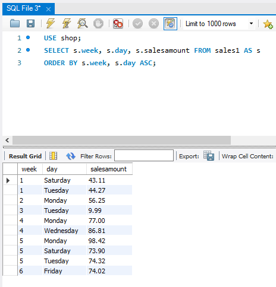

#### 2. Change the name of salesperson Inga to be Annette instead, but only where Ignas Sales are <50.
Answer: First checking if there is an Inga in the database and how many records are there to know, so I can know if I will get the correct result – there is only 1 Inga sale and it is for under 10 pounds.

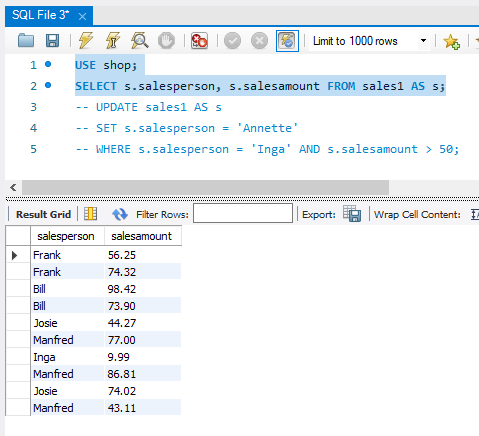

Then running the requested query – swapping “Inga” for “Annette” in records where Inga’s sale is under 50 pounds – this means in inly 1 record, the only one of Inga’s:

    USE shop;
    UPDATE sales1 AS s
    SET s.salesperson = 'Annette'
    WHERE s.salesperson = 'Inga' AND s.salesamount < 50;
    SELECT s.salesperson, s.salesamount FROM sales1 AS s;
    
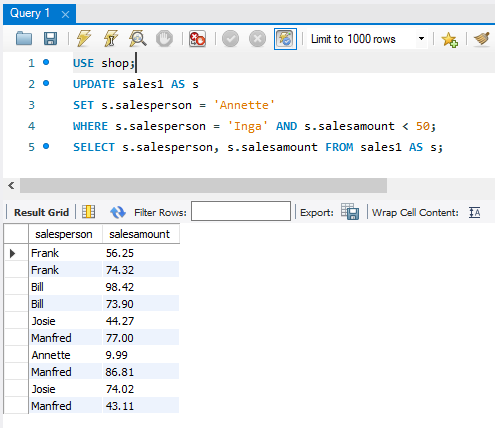

It shows no Inga and the sales of 9.99 is ascribed to Annette so it looks like it worked 😊

#### 3. Find out how many sales the London office logged
- Note we’re looking for quantity here - e.g. if London did 6 sales, then output would be 6)

    USE shop;
    SELECT 
    COUNT(DISTINCT s.salesamount) FROM sales1 AS s
    WHERE store = 'LONDON';
    
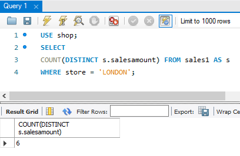

#### 4. Find the total (sum) sales amount by each person by day

    USE shop;
    SELECT 
    SUM(s.salesamount), s.day, s.salesperson FROM sales1 AS s
    GROUP BY s.day, s.salesperson;
    
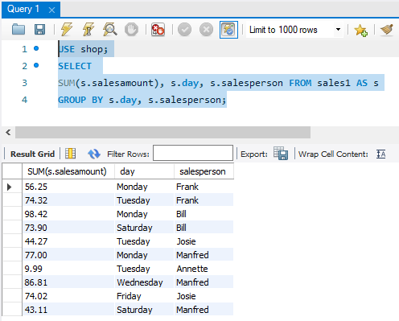

#### 5. How much (sum) each person sold for between week 1 and week 3

    USE shop;
    SELECT 
    SUM(s.salesamount), s.salesperson FROM sales1 AS s
    WHERE s.week BETWEEN 1 AND 3
    GROUP BY s.salesperson;

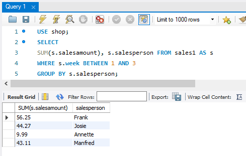

Checking the result:

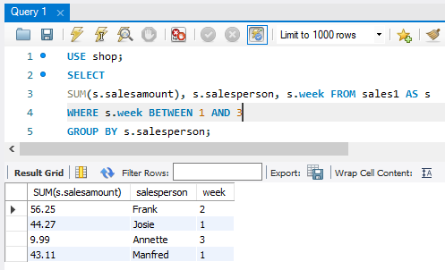

These results are for weeks 1 till 3, correct.

Results from weeks 4 and 5 are omitted:

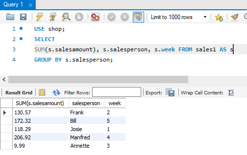

#### 6. For each store:
- The total of their sales;
- The number of sales;
- Their average sales;
- Their lowest sales amount;
- Their highest sales amount.

Answer:

    USE shop;
    SELECT 
    SUM(s.salesamount), COUNT(s.salesamount), AVG(s.salesamount), MIN(s.salesamount), MAX(s.salesamount), s.store FROM sales1 AS s
    GROUP BY s.store;
    
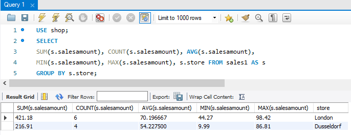

#### 7. Find the average (AVG) monetary sales amount achieved by each store

    USE shop;
    SELECT 
    AVG(s.salesamount), s.store FROM sales1 AS s
    GROUP BY s.store;

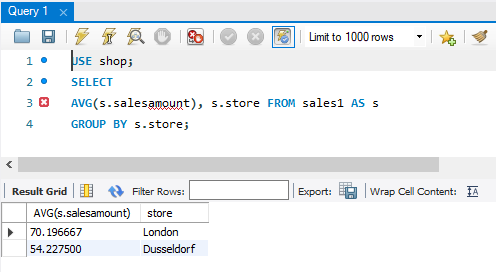

#### 8. Count the number of sales by each person if they had less than 3 sales for the past period

    USE shop;
    SELECT 
    COUNT(s.salesamount), s.salesperson FROM sales1 AS s
    GROUP BY s.salesperson
    HAVING COUNT(s.salesamount) < 3;

This result seems to be correct because removing the limitation “having count less than 3” results in showing 1 more result, with 3 sales:

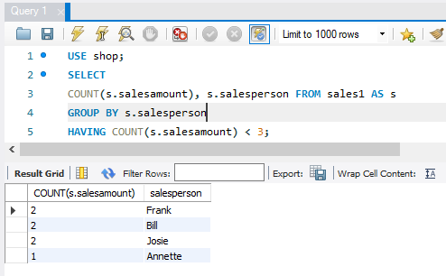

#### 9. Find the number (count) of sales by each person, but only if they made less than or equal to £300 worth of sales for the past period

    USE shop;
    SELECT 
    COUNT(s.salesamount), s.salesperson FROM sales1 AS s
    GROUP BY s.salesperson
    HAVING SUM(s.salesamount) <= 300;

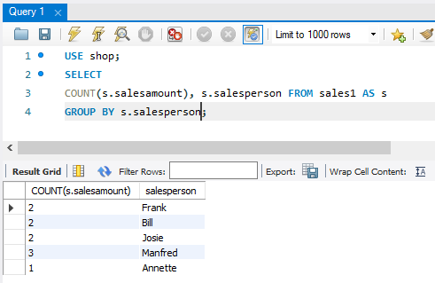

This result seems correct, these people made sales of under 300 GBP:

## TASK 3 - Use Parts DB to write the following queries:

#### 1. Return the PartID, Colour and Supplier name, where the supplier’s surname ends in an S, and the Supplier city is not London. Ensure the values are Unique.

Answer:

    USE parts;
    SELECT  DISTINCT p.p_id, p.colour, s.sname
    FROM part AS p
    LEFT JOIN supply AS a
    ON p.P_ID = a.P_ID
    LEFT JOIN supplier AS s
    ON a.S_ID = s.S_ID
    WHERE s.SNAME LIKE ‘%S’ AND s.CITY != ‘LONDON’;

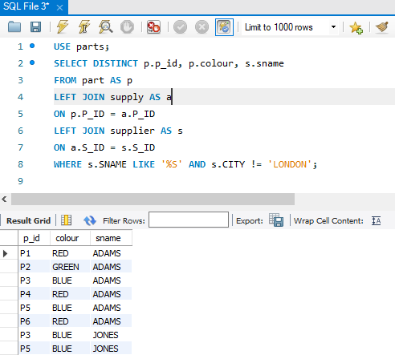

I tried using the multiquery we used in class with “IN” but it did not support 2 search values/filters, so I’ve used a multi join to first join these tables into 1 searchable table, and then applied the query limitations %S and !=LONDON as well as DISTINCT because in here due to other values in other columns (not visible here) being different, the result without “DISTINCT” gave a result with a lot of duplicates.

#### 2. Return the supplier name, part name and project name for each case where the following conditions are true:
i. The supplier supplies a project with a part;
Ii. And where the supplier’s city, project city and part city are the same.

Answer:

    USE parts;
    SELECT s.sname, p.pname, j.jname
    FROM part AS p
    LEFT JOIN supply AS a
    ON p.P_ID = a.P_ID
    LEFT JOIN supplier AS s
    ON a.S_ID = s.S_ID
    LEFT JOIN project AS j
    ON a.J_ID = j.J_ID
    WHERE a.QUANTITY !='0' AND a.QUANTITY IS NOT NULL AND s.CITY = j.CITY AND j.CITY = p.CITY;

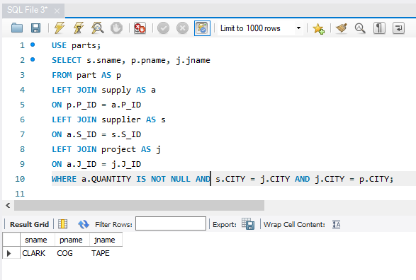

Condition 1 – I used the “quantity” as “not null” as well as “not equal to zero” as means of answering the condition one = supplier supplies a project with a part – quantity of parts must then be positive, so neither missing (null) nor zero, it must be greater than zero to meet this condition.

Condition 2 – supplier city = project city and project city = part city. Checks if these values are equal – I’ve checked also with the variables uncovered, it says “LONDON” in all 3 of these cases.
